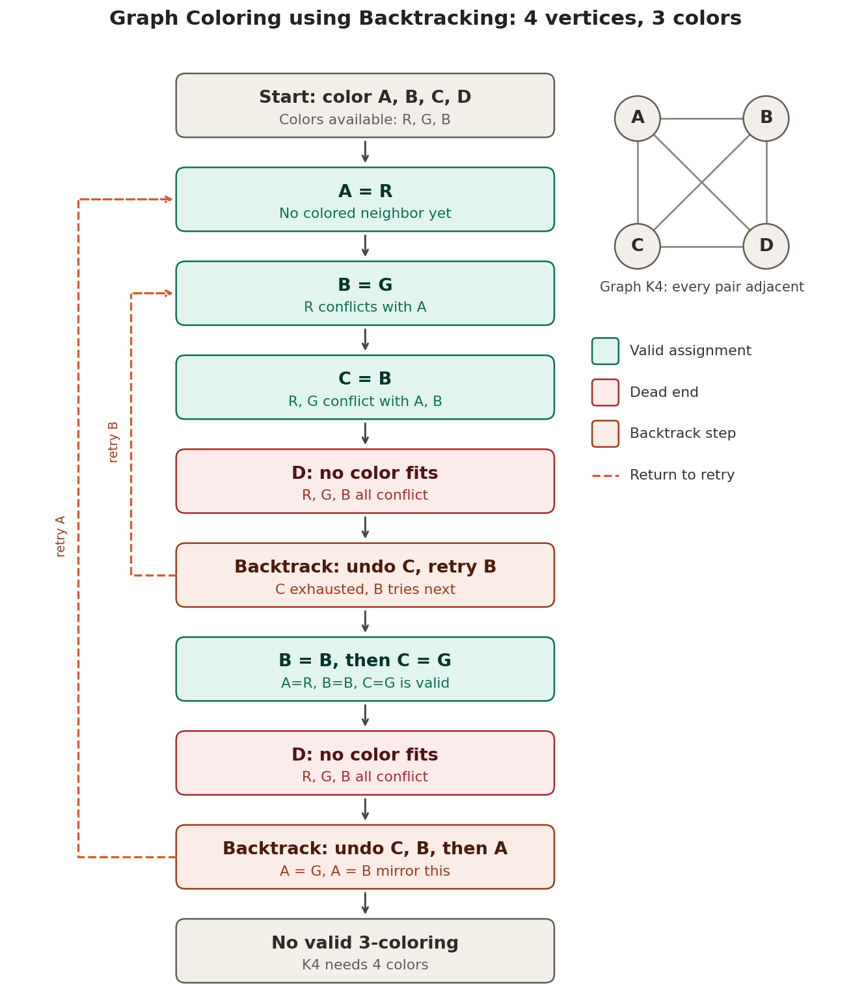

# Graph Coloring using Backtracking

**Course:** Design and Analysis of Algorithms (DAA) Macro Project
**Student:** `<Your Name>` | **Roll No:** `<Roll No>` | **Group:** `<Group No>`
**Language:** Java | **Unit:** `<Unit No>` | **Technique:** Backtracking

## 1. Problem statement
Given an undirected graph and `m` colors, assign a color to every vertex so that no two adjacent vertices share a color (the m-coloring problem).

This project colors a 4-vertex graph (A, B, C, D) with 3 colors (R, G, B). Every pair of vertices is connected (K4), which forces the maximum amount of backtracking.

## 2. Algorithm (pseudocode)
```
GraphColoring(index, assignment, graph, m)
    if index == number of vertices
        return TRUE                      // every vertex colored
    v = vertex at position index
    for each color c in 1..m
        if IsSafe(v, c, assignment, graph)
            assignment[v] = c            // assign
            if GraphColoring(index + 1, assignment, graph, m)
                return TRUE
            assignment[v] = none         // BACKTRACK (undo)
    return FALSE                         // no color works, go back

IsSafe(v, c, assignment, graph)
    for each neighbor u of v
        if assignment[u] == c
            return FALSE
    return TRUE
```

## 3. Complexity
| Measure | Value |
|---|---|
| Time (worst case) | O(m^V) |
| Time with pruning | Far smaller in practice; conflicts cut branches early |
| Space | O(V) for the assignment array and recursion stack |

For V = 4 and m = 3 there are at most 3^4 = 81 full assignments, but pruning visits far fewer.

## 4. AI prompt used
> "Illustrate backtracking steps for coloring a 4-vertex graph using 3 colors."

AI tool: Claude (Anthropic). The full prompt record is in [`Prompt.txt`](Prompt.txt).

## 5. AI-generated visualization
Flowchart of the steps:



The same steps drawn on the graph itself (vertices colored, conflicts in red, undone vertices dashed):


Bonus: after removing edge A-D, three colors are enough:


## 6. Explanation of logic and visualization
1. Vertices are colored in the order A, B, C, D, trying R, G, B for each.
2. A color is rejected if a neighbor already uses it (a conflict).
3. A = R, B = G, C = B are valid. D has neighbors using all three colors, so it is a dead end.
4. The algorithm backtracks: C has no other color, so C is undone and B tries its next color, B = B. Then C = G works, but D fails again.
5. It backtracks further, undoing C, B and finally A. The branches A = G and A = B mirror this and also fail.
6. Every option is exhausted, so K4 cannot be colored with 3 colors (it needs 4).

In the flowchart, green boxes are valid assignments, red boxes are dead ends, orange boxes are backtracks, and dashed arrows show where the search returns to retry.

## 7. How to run
```bash
javac GraphColoring.java
java GraphColoring
```
Expected last line: `Result: No valid 3-coloring exists`.
To see a successful coloring, remove one edge in `GRAPH` by setting `GRAPH[0][3]` and `GRAPH[3][0]` to 0 (removes edge A-D), then run again. The result becomes `A=R B=G C=B D=R`.

## 8. Files
| File | Description |
|---|---|
| `GraphColoring.java` | Java implementation of backtracking that prints every step |
| `Prompt.txt` | AI prompt and expected outcome |
| `README.md` | Project documentation |
| `Visualization.png` | AI-generated flowchart |
| `Visualization_Graph.png` | Step-by-step colored graph (8 panels) |
| `Visualization_Solved_Graph.png` | Bonus: successful coloring after removing edge A-D |

## 9. Applications
Timetable and exam scheduling, register allocation in compilers, map coloring, frequency assignment in networks.