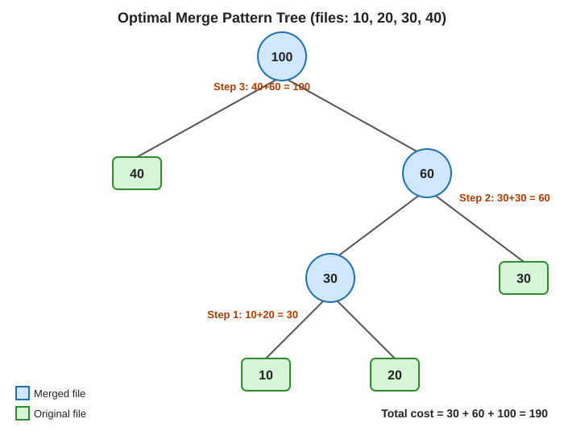

# Optimal Merge Pattern Tree

A greedy-algorithm project that finds the minimum-cost way to merge several sorted
files into one, and visualizes the result as a weighted binary merge tree.

## Problem Statement
Given files of sizes **10, 20, 30, 40**, determine the merge order that minimizes the
total merge cost, and draw the corresponding binary tree.

## Approach
Greedy method using a min-heap: repeatedly remove the two smallest files, merge them,
add the cost, and insert the merged file back. See [`algorithm.md`](algorithm.md) for the pseudocode.

## Result

| Step | Merge   | Result | Cost |
|------|---------|--------|------|
| 1    | 10 + 20 | 30     | 30   |
| 2    | 30 + 30 | 60     | 60   |
| 3    | 40 + 60 | 100    | 100  |

**Total minimum cost: 190**

## Visualization
AI-generated using the prompt in [`prompt.md`](prompt.md):



## Files
| File | Description |
|------|-------------|
| `algorithm.md` | Algorithm, pseudocode, dry run, complexity |
| `prompt.md` | Prompt used to generate the diagram |
| `merge_tree.svg` | AI-generated weighted merge tree |
| `explanation.md` | Short explanation of algorithm and visualization |
| `optimal_merge.py` | Python implementation |

## How to Run
```bash
python optimal_merge.py
```

Expected output:
```
Step 1: merge 10 + 20 = 30
Step 2: merge 30 + 30 = 60
Step 3: merge 40 + 60 = 100
Minimum total cost: 190
```

## Complexity
Time O(n log n), Space O(n).
