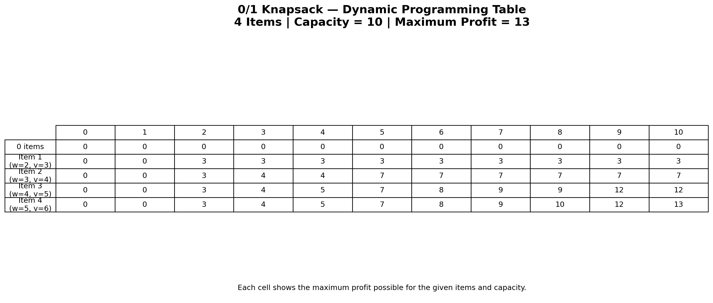

# 0/1 Knapsack using Dynamic Programming

## Description

This project implements the 0/1 Knapsack problem using Dynamic
Programming and visualizes the DP table for 4 items with a
knapsack capacity of 10.

## Problem Statement

Draw a DP table for 0/1 Knapsack with 4 items and capacity 10,
showing item inclusion decisions.

## Input

Weights:
[2, 3, 4, 5]

Values:
[3, 4, 5, 6]

Capacity:
10

## Algorithm

1. Create a DP table with rows representing items.
2. Create columns representing capacities from 0 to 10.
3. For each item, check whether its weight can fit in the current
   capacity.
4. Calculate the profit by including the item.
5. Calculate the profit by excluding the item.
6. Store the maximum of the two values.
7. The final cell contains the maximum possible profit.

## Pseudocode

START

Set weights = [2,3,4,5]
Set values = [3,4,5,6]
Set capacity = 10

Create DP table

For each item:
    For each capacity:
        If item weight <= capacity:
            include = item value + previous DP value
            exclude = previous DP value
            DP = maximum(include, exclude)
        Else:
            DP = previous DP value

Display DP table
Display maximum profit

END

## Prompt Used

"Create a clear visualization of a 0/1 Knapsack Dynamic Programming
table with 4 items and capacity 10. Show item weights and values,
DP table, capacity values, item inclusion decisions, and highlight
the final maximum profit."

## Output

The generated Dynamic Programming table is shown below.

### Result

**Maximum Profit = 13**

## Learning Outcome

- Understood the 0/1 Knapsack problem.
- Learned Dynamic Programming table construction.
- Understood item inclusion and exclusion decisions.
- Practiced algorithm visualization and GitHub documentation.