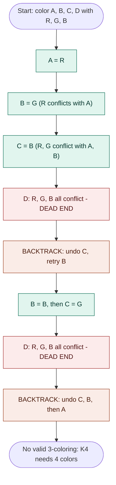
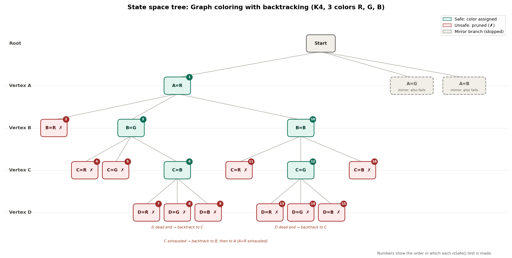

# Graph Coloring using Backtracking

**Course:** Design and Analysis of Algorithms (DAA) Macro Project
**Student:** Gundu Sai Nandhini | **Roll No:** 25WH5A0503 | **Group:** 3
**Language:** Java | **Unit:** 4 | **Technique:** Backtracking

## 1. Problem statement
Given an undirected graph and `m` colors, assign a color to every vertex so that no two adjacent vertices share a color (the m-coloring problem).

This project colors a 4-vertex graph (A, B, C, D) with 3 colors (R, G, B). Every pair of vertices is connected (K4), which forces the maximum amount of backtracking.

```
A --- B
| \ / |
| / \ |
C --- D
```

## 2. Algorithm (pseudocode)
```
GraphColoring(index, assignment, graph, m)
    if index == number of vertices
        return TRUE                      // every vertex colored
    v = vertex at position index
    for each color c in 1..m
        if IsSafe(v, c, assignment, graph)
            assignment[v] = c            // assign
            if GraphColoring(index + 1, assignment, graph, m)
                return TRUE
            assignment[v] = none         // BACKTRACK (undo)
    return FALSE                         // no color works, go back

IsSafe(v, c, assignment, graph)
    for each neighbor u of v
        if assignment[u] == c
            return FALSE
    return TRUE
```

## 3. Complexity
| Measure | Value |
|---|---|
| Time (worst case) | O(m^V) |
| Time with pruning | Far smaller in practice; conflicts cut branches early |
| Space | O(V) for the assignment array and recursion stack |

For V = 4 and m = 3 there are at most 3^4 = 81 full assignments, but pruning visits far fewer.

## 4. AI prompt used
> "Illustrate backtracking steps for coloring a 4-vertex graph using 3 colors."

**Expected outcome:** Flowchart showing color assignments and backtracks.
**AI tool:** Claude (Anthropic). The full prompt record is in [`Prompt.txt`](Prompt.txt).

## 5. AI-generated visualization

### 5.1 Flowchart (green = valid, red = dead end, orange = backtrack)



### 5.2 State space tree (branch A = R; X = pruned)



Text version of the same tree:

```
Root
└── A=R
    ├── B=R  X  (conflicts with A)
    ├── B=G
    │   ├── C=R  X
    │   ├── C=G  X
    │   └── C=B
    │       ├── D=R  X
    │       ├── D=G  X
    │       └── D=B  X   <- dead end, BACKTRACK
    └── B=B
        ├── C=R  X
        ├── C=G
        │   ├── D=R  X
        │   ├── D=G  X
        │   └── D=B  X   <- dead end, BACKTRACK
        └── C=B  X
```
The branches A = G and A = B are mirror images of this tree and fail the same way.

### 5.3 Step-by-step table
| Step | Action | Graph state | Result |
|---|---|---|---|
| 1 | Assign A = R | A=R | Valid |
| 2 | Try B = R | A=R | Conflict with A |
| 3 | Assign B = G | A=R, B=G | Valid |
| 4 | Try C = R, C = G | A=R, B=G | Conflicts |
| 5 | Assign C = B | A=R, B=G, C=B | Valid |
| 6 | Try D = R, G, B | A=R, B=G, C=B | All conflict (dead end) |
| 7 | Backtrack: undo C, then B | A=R | Retry B |
| 8 | Assign B = B, then C = G | A=R, B=B, C=G | Valid |
| 9 | Try D = R, G, B | A=R, B=B, C=G | All conflict (dead end) |
| 10 | Backtrack: undo C, B, then A | none | Retry A |
| 11 | A = G and A = B | none | Mirror cases, all fail |
| 12 | Final | none | No valid 3-coloring |

## 6. Explanation of logic and visualization
1. Vertices are colored in the order A, B, C, D, trying R, G, B for each.
2. A color is rejected if a neighbor already uses it (a conflict).
3. A = R, B = G, C = B are valid. D has neighbors using all three colors, so it is a dead end.
4. The algorithm backtracks: C has no other color, so C is undone and B tries its next color, B = B. Then C = G works, but D fails again.
5. It backtracks further, undoing C, B and finally A. The branches A = G and A = B mirror this and also fail.
6. Every option is exhausted, so K4 cannot be colored with 3 colors (it needs 4).

## 7. Sample output
```
ASSIGN    A = R
  CONFLICT  B = R not allowed
  ASSIGN    B = G
    CONFLICT  C = R not allowed
    CONFLICT  C = G not allowed
    ASSIGN    C = B
      CONFLICT  D = R not allowed
      CONFLICT  D = G not allowed
      CONFLICT  D = B not allowed
    BACKTRACK C = B removed
  BACKTRACK B = G removed
  ASSIGN    B = B
    CONFLICT  C = R not allowed
    ASSIGN    C = G
      CONFLICT  D = R not allowed
      CONFLICT  D = G not allowed
      CONFLICT  D = B not allowed
    BACKTRACK C = G removed
    CONFLICT  C = B not allowed
  BACKTRACK B = B removed
BACKTRACK A = R removed
...
Result: No valid 3-coloring exists
```

## 8. How to run
```bash
javac GraphColoring.java
java GraphColoring
```
Expected last line: `Result: No valid 3-coloring exists`.
To see a successful coloring, remove one edge in `GRAPH` by setting `GRAPH[0][3]` and `GRAPH[3][0]` to 0 (removes edge A-D), then run again. The result becomes `A=R B=G C=B D=R`.

## 9. Files
| File | Description |
|---|---|
| `GraphColoring.java` | Java implementation of backtracking that prints every step |
| `Prompt.txt` | AI prompt and expected outcome |
| `README.md` | Project documentation |
| `Visualization_StateSpaceTree.png` | State space tree with pruned nodes and test order |

## 10. Applications
Timetable and exam scheduling, register allocation in compilers, map coloring, frequency assignment in networks.