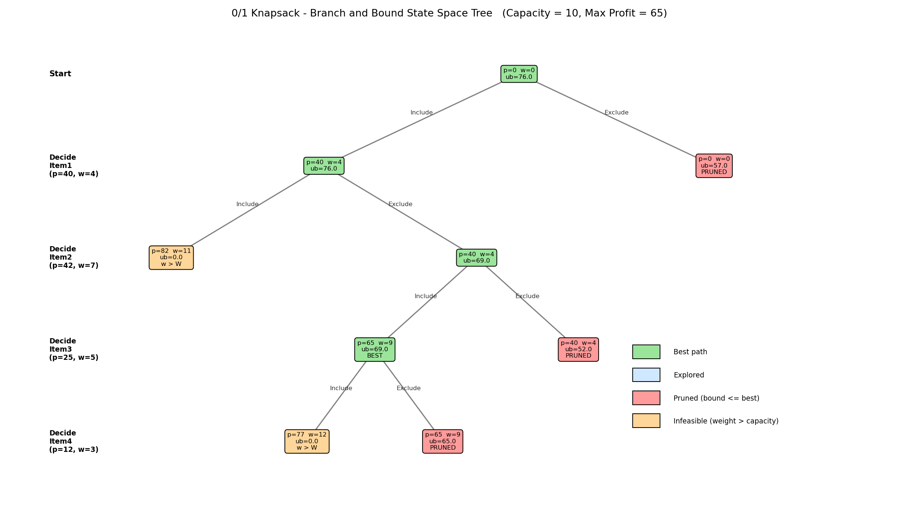

# Project Title
0/1 Knapsack Problem using Branch and Bound

## Description
This project solves the 0/1 Knapsack problem using the **Branch and Bound** technique
and visualizes the state space tree (with bounding and pruning) through prompt engineering.

**Input:** 4 items, knapsack capacity W = 10

| Item  | Profit | Weight | Profit/Weight |
|-------|--------|--------|---------------|
| Item1 | 40     | 4      | 10.0          |
| Item2 | 42     | 7      | 6.0           |
| Item3 | 25     | 5      | 5.0           |
| Item4 | 12     | 3      | 4.0           |

## Algorithm
```
1. Sort items by profit/weight ratio (highest first)
2. Create root node (no decision taken), best_profit = 0
3. For each node, compute UPPER BOUND:
       bound = profit so far
             + profit of next items that fit completely
             + fraction of the first item that does not fit
4. Branch on the next item (DFS):
       Left child  -> INCLUDE the item
       Right child -> EXCLUDE the item
5. Prune a node if
       weight > capacity        (infeasible)
       OR bound <= best_profit  (cannot improve the answer)
6. If a feasible node has profit > best_profit, update best_profit
7. Stop when no live nodes remain; best_profit is the answer
```

## Prompt Used
"Illustrate bounding and pruning in 0/1 Knapsack using node values."
(Full prompt is in `Prompt.txt`)

## How to Run
```
pip install matplotlib
python Project13_Knapsack_BnB.py
```
This prints the node table in the terminal and creates `Visualization.png`.

## Output


- **Maximum profit:** 65
- **Items selected:** Item1 + Item3 (total weight 9)
- **Green** = path to the best solution, **Red** = pruned (bound <= best),
  **Orange** = infeasible (weight > capacity)

## Explanation of the Visualization
- The root has upper bound 76 (the best we could hope for with fractions).
- Including Item1 and Item2 gives weight 11 > 10, so that branch is infeasible.
- Including Item1 and Item3 reaches profit 65, which becomes the best answer.
- Remaining nodes have bounds (65, 52, 57) that are not better than 65, so they are pruned
  and never explored further. This saves work compared to checking all 2^4 combinations.

## Learning Outcome
- Understood bounding and pruning in Branch and Bound.
- Learned how to calculate an upper bound using the fractional knapsack idea.
- Learned prompt-based visualization.
- Practiced GitHub documentation.
