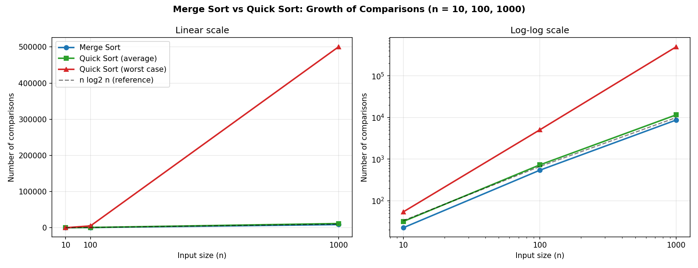

# Sorting Complexity Visualizer (Project 1, Unit I: Algorithm Analysis)

## Description
This project implements Merge Sort and Quick Sort, counts the key comparisons each performs for
n = 10, 100 and 1000, and plots the growth rates as line charts using prompt-driven visualization.

## Algorithm

**Merge Sort**
```
MERGE-SORT(A):
    if length(A) <= 1: return A
    mid = length(A) / 2
    L = MERGE-SORT(A[0..mid-1])
    R = MERGE-SORT(A[mid..end])
    return MERGE(L, R)

MERGE(L, R):
    i = j = 0; result = []
    while i < |L| and j < |R|:
        if L[i] <= R[j]: append L[i] to result; i++
        else:            append R[j] to result; j++
    append remaining elements of L and R
    return result
```
Recurrence: T(n) = 2T(n/2) + O(n), giving **O(n log n)** in all cases.

**Quick Sort**
```
QUICK-SORT(A):
    if length(A) <= 1: return A
    pivot = choose element of A
    less    = elements < pivot
    equal   = elements == pivot
    greater = elements > pivot
    return QUICK-SORT(less) + equal + QUICK-SORT(greater)
```
Average: T(n) = 2T(n/2) + O(n) = **O(n log n)**.
Worst case (already sorted input, last element as pivot): T(n) = T(n-1) + O(n) = **O(n^2)**.

## Prompt Used
"Generate a graph comparing time complexity of Merge and Quick Sort for n = 10, 100, 1000."
(See `Prompt.txt` for the full prompt.)

## Output


Measured comparisons (averaged over 20 random inputs; worst case is a single sorted input):

| n    | Merge Sort | Quick Sort (avg) | Quick Sort (worst) |
|------|-----------:|-----------------:|-------------------:|
| 10   | 22         | 32               | 54                 |
| 100  | 541        | 726              | 5,049              |
| 1000 | 8,708      | 11,596           | 500,499            |

## Explanation
- Left chart (linear scale): the quadratic blow-up of Quick Sort's worst case dwarfs everything else at n = 1000.
- Right chart (log-log scale): Merge Sort and average Quick Sort stay close to the n log n reference line,
  while the worst case has a visibly steeper slope (about n^2).
- Merge Sort needs slightly fewer comparisons, but Quick Sort is often faster in practice because it sorts in place
  and has better cache behaviour.

## How to Run
```
pip install matplotlib
python Project1_SortingComplexity.py
```

## Learning Outcome
- Understood how divide-and-conquer recurrences lead to O(n log n) and O(n^2) growth.
- Learned to compare best, average and worst cases empirically.
- Learned prompt-based visualization.
- Practiced GitHub documentation.
